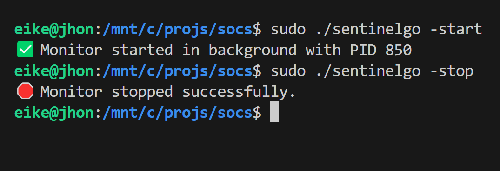
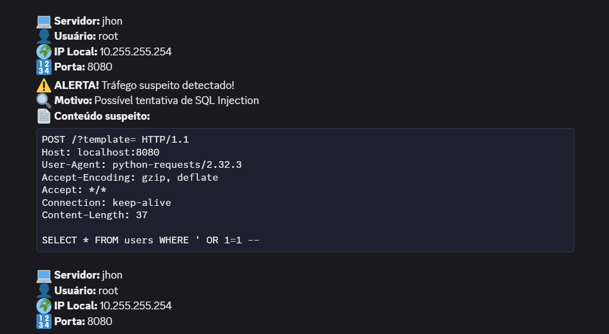
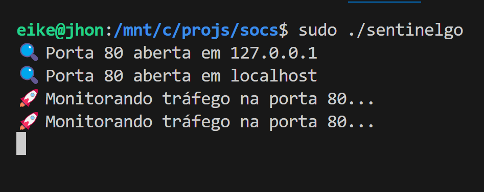
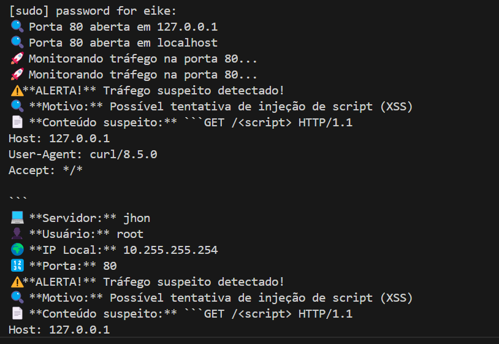

# Sentinelgo is a Sniffer integrated with discord's WEBHOOK 

### This script is written in GOLANG based on templates and runs specifically on Linux x64 servers.
### It will help you monitor hacking attempts on your server, generating an alert for each hacking attempt.

# Download and configure

## clone git repository.

```bash 
git clone https://github.com/eikehacker1/sentinelgo.git && \
cd sentinelgo && \
chmod +x sentinelgo

```

# Quickly get your discord webhook
[ Link - Discord's Webhook](https://support.discord.com/hc/pt-br/articles/228383668-Usando-Webhooks)

# Configure YAML templates in /config

### In /config/apidiscord.yaml is your webhook for your discord server.

```yaml
webhook_url: "https://discord.com/api/webhooks/xxxxxxxxxx/xxxxxxxxxxxxxxxxxxxxxxxxxxxxxxxxxxxxxxxxx" 
```

### In /config/ipsportsc.yaml are the internals and internal targets that it will scan in a portscan and listen for these open ports.

```yaml
targets:
  - "127.0.0.1"
  - "localhost"
  - "192.168.0.1"
  # Add here the internal IPs of your server that you want to listen to.
```
### Now configure /configure/whitelist.yaml , pay close attention here as this is where you will configure and block server to server requests and this can cause bugs in your application.
For example: you can add or domain with a specific port 127.0.0.1:3306

```yaml
whitelist:
  ips:
    - "127.0.0.1:3306" # Will ignore connection on localhost DB connection 
    - "192.168.0.1"
  domains:
    - "example.com"
    - "trusted.com" #specific domains in case you use reverse proxy or remote connection
```
### In /config/patterns.yaml are the payloads that will serve as the basis for monitoring. It is already pre-populated with some known vulnerabilities, but you can remove or add payloads and pattern queries that you observe.

```yaml
suspicious_patterns:
- pattern: "<script>"
  description: "Possível tentativa de injeção de script (XSS)"
- pattern: "SELECT * FROM"
  description: "Possível tentativa de SQL Injection"
- pattern: "DROP TABLE"
  description: "Tentativa de deletar tabelas no banco de dados"
- pattern: "' OR 1=1"
  description: "SQL Injection tentando obter todos os registros"
- pattern: "../"
  description: "Tentativa de Path Traversal"
```

# How to use

### Start process in backgroung - PID

```bash
sudo ./sentinelgo -start
```
### Stop the process when necessary

```bash
sudo  ./sentinelgo -stop
```



# Now let's test if it's working

### Now let's test if it's working

Let's test the server, install the dependencies using pip:
```bash
pip install flask && pip install requests
```

Run the test server:

```bash
python3 python/server.py
```
Run the exploit:

```bash
python3 requests/teste.py
```

### If everything is ok, then you will see a message like this on your discord server



Take a good look at the yaml files to make sure the communication is being done perfectly and adjust it according to your needs.
This script also does not cover the premium versions of other paid EDRS, it is just a small test.
It informs the PID and in case of system error, use htop or another task manager to stop your task.
To view the ports without standby and see which targets are being monitored, just test in debug mode, which is just running without flag:



After-test:


